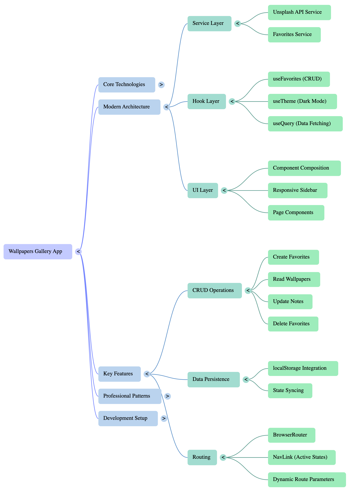

# Wallpapers Gallery 

> A production-ready application built with React, TypeScript, TanStack Query, and modern best practices. Features a **wallpapers gallery with full CRUD operations** using the Unsplash API - browse beautiful wallpapers, save favorites, add notes, and persist data with localStorage. Perfect for learning professional front-end development!

## Architecture Overview



*Visual overview of the application architecture showing the relationship between Core Technologies, Modern Architecture patterns, UI Layer, CRUD Operations, and Key Features.*

---

## Project Structure

```
basic-react-app-wallpaper/
├── .env                       # Environment variables (API keys) - NOT committed
├── .env.example               # Template for environment variables - committed
├── .gitignore                 # Files to exclude from Git
├── index.html                 # HTML entry point
├── package.json               # Dependencies and scripts
├── tsconfig.json              # TypeScript configuration
├── tailwind.config.js         # Tailwind CSS configuration
├── vite.config.js             # Vite build tool configuration
├── postcss.config.js          # PostCSS configuration
├── README.md                  # Documentation (this file)
│
src/
├── App.tsx                    # Main application component (routing setup)
├── main.tsx                   # Entry point - React app initialization
├── index.css                  # Global styles + Tailwind directives
├── vite-env.d.ts              # TypeScript definitions for environment variables
│
├── pages/                     # Page Components (Routes)
│   ├── HomePage.tsx              # Landing page (/)
│   ├── WallpapersPage.tsx        # Wallpapers gallery (/wallpapers)
│   ├── SettingsPage.tsx          # Settings and theme (/settings)
│   └── index.ts                  # Page exports
│
├── routes/                    # Routing Configuration
│   └── index.tsx                 # Route definitions
│
├── components/                # UI Components
│   └── ui/                       # shadcn/ui components
│       ├── layouts/              # Layout components
│       │   ├── Header.tsx        # Top navigation bar
│       │   └── Sidebar.tsx       # Left navigation sidebar (with routing)
│       ├── button.tsx            # Styled button with variants
│       ├── input.tsx             # Styled input field
│       ├── card.tsx              # Card container components
│       └── badge.jsx             # Status badges
│
├── hooks/                     # Custom React Hooks
│   ├── useTheme.ts               # Dark mode theme management
│   ├── useFavorites.ts           # Wallpaper favorites CRUD + localStorage
│   └── index.ts                  # Hook exports
│
├── services/                  # Business Logic Layer
│   ├── unsplashService.ts        # Unsplash API integration (uses env vars)
│   ├── favoritesService.ts       # Favorites CRUD + localStorage persistence
│   └── index.ts                  # Service exports
│
├── types/                     # TypeScript Type Definitions
│   └── index.ts                  # All interfaces and types
│
└── lib/                       # Utility Functions
    └── utils.js                  # Helper functions (cn for classes)
```

---

## Quick Start

### **Prerequisites**
- Node.js installed (v16 or higher)
- Basic understanding of JavaScript/TypeScript
- Familiarity with HTML/CSS
- Unsplash API key (free at [unsplash.com/developers](https://unsplash.com/developers))

### **Installation**

```bash
# 1. Install dependencies
npm install

# 2. Set up environment variables
cp .env.example .env
# Then edit .env and add your Unsplash API key

# 3. Start development server
npm run dev

# Open in browser
# http://localhost:5173
```

### **Build for Production**
```bash
npm run build
```

### **Environment Configuration**

Environment variables store API keys and secrets outside your code.

#### **Quick Setup**

1. **Copy template:**
   ```bash
   cp .env.example .env.local
   ```

2. **Add your Unsplash API key:**
   ```bash
   # .env.local (or .env)
   VITE_UNSPLASH_ACCESS_KEY=your_actual_key_here
   ```
   Get free API key: [unsplash.com/developers](https://unsplash.com/developers)

3. **Restart dev server:**
   ```bash
   npm run dev
   ```

#### **Environment Files**

```
.env.development    # Development defaults (can be committed)
.env.production     # Production defaults (can be committed)
.env.local          # Your actual keys (gitignored - use this!)
.env.example        # Template (committed)
```

**Best practice:**
- Use **`.env.local`** for your actual API keys (never committed)
- Use **`.env.development`** / **`.env.production`** for environment-specific defaults
- Always commit **`.env.example`** as a template

#### **Usage**

**Vite requires `VITE_` prefix:**
```typescript
// ✅ Correct
const key = import.meta.env.VITE_UNSPLASH_ACCESS_KEY;

// ❌ Won't work
const key = import.meta.env.UNSPLASH_KEY;
```

**TypeScript types** ([src/vite-env.d.ts](src/vite-env.d.ts)):
```typescript
interface ImportMetaEnv {
  readonly VITE_UNSPLASH_ACCESS_KEY: string;
}
```

**Security:** Never commit `.env.local` or files with real keys. For production, set env vars in your hosting platform (Vercel, Netlify, etc.).

---

## Understanding the Architecture

### **1. Data Flow**

```
Click Heart → Hook (logic) → Service (CRUD) → Update State → UI Updates
```

**Example: Adding a Favorite**
1. **User clicks** heart icon
2. **Hook processes** the action with `useFavorites`
3. **Service handles** the data with `favoritesService.addFavorite()`
4. **State updates** and React re-renders the UI automatically
5. **Saved** to localStorage for persistence

This pattern keeps your components clean—they just call functions, and hooks + services handle the complexity.

### **2. Custom Hooks**

#### **`useFavorites` Hook** ([src/hooks/useFavorites.ts](src/hooks/useFavorites.ts))

```typescript
// Instead of managing favorites in WallpapersPage.tsx:
const [favorites, setFavorites] = useState([]);
const addFavorite = (photo) => { /* logic here */ };
const removeFavorite = (id) => { /* logic here */ };

// We extract it to a reusable hook:
const { favorites, addToFavorites, removeFromFavorites, isFavorited, stats } = useFavorites();
```

**Benefits:** Reusable logic across components, auto-saves to localStorage, cleaner component code.

#### **`useTheme` Hook** ([src/hooks/useTheme.ts](src/hooks/useTheme.ts))

```typescript
const { isDark, toggleTheme } = useTheme();
```

**What it does:**
- Manages dark/light mode state
- Applies theme class to `<html>` element
- Persists preference to localStorage
- Provides helper methods

### **3. Service Layer**

The `favoritesService` ([src/services/favoritesService.ts](src/services/favoritesService.ts)) contains all business logic:

```typescript
// Create
favoritesService.addFavorite(favorites, photo, notes)

// Read
favoritesService.loadFavorites()
favoritesService.isFavorited(favorites, photoId)

// Update
favoritesService.updateFavoriteNotes(favorites, photoId, newNotes)

// Delete
favoritesService.removeFavorite(favorites, photoId)

// Stats
favoritesService.getFavoritesStats(favorites)

// Storage
favoritesService.saveFavorites(favorites)
```

**Why separate services?** Easy to swap localStorage for API calls later, and reusable across different UIs.

---

## Routing with React Router

### **What is Routing?**

Routing allows you to navigate between different views (pages) in your app without full page reloads. We use **React Router** to create a single-page application (SPA) with multiple pages.

```
Homepage (/)              →  Welcome page
Wallpapers (/wallpapers)  →  Gallery and favorites
Settings (/settings)      →  Theme and preferences
```

### **How It Works**

#### **1. Routes Configuration** ([src/routes/index.tsx](src/routes/index.tsx))

```typescript
// Define all routes in one place
import { RouteObject } from 'react-router-dom';
import { HomePage, WallpapersPage, SettingsPage } from '@/pages';

export const routes: RouteObject[] = [
  {
    path: '/',
    element: <HomePage />,
  },
  {
    path: '/wallpapers',
    element: <WallpapersPage />,
  },
  {
    path: '/settings',
    element: <SettingsPage />,
  },
];
```

**Benefits:** Centralized route configuration, easy to see app structure, type-safe.

#### **2. Router Setup** ([src/App.tsx](src/App.tsx))

```typescript
import { BrowserRouter, Routes, Route } from 'react-router-dom';
import { routes } from './routes';

function App() {
  return (
    <BrowserRouter>
      <div className="flex">
        <Sidebar />
        <div className="flex-1">
          <Header />
          <main>
            <Routes>
              {routes.map((route, index) => (
                <Route key={index} {...route} />
              ))}
            </Routes>
          </main>
        </div>
      </div>
    </BrowserRouter>
  );
}
```

**Components:**
- `<BrowserRouter>` - Wraps entire app, enables routing
- `<Routes>` - Container for all route definitions
- `<Route>` - Individual route (path + component)

#### **3. Navigation with NavLink** ([src/components/ui/layouts/Sidebar.tsx](src/components/ui/layouts/Sidebar.tsx))

```typescript
import { NavLink } from 'react-router-dom';

<NavLink
  to="/wallpapers"
  className={({ isActive }) => 
    `flex items-center gap-3 px-3 py-2 rounded-lg ${
      isActive 
        ? 'bg-blue-500 text-white' 
        : 'hover:bg-gray-100 dark:hover:bg-gray-800'
    }`
  }
>
  <Image className="h-5 w-5" />
  {!isCollapsed && <span>Wallpapers</span>}
</NavLink>
```

**NavLink vs Link:**

| Feature | `<NavLink>` | `<Link>` |
|---------|------------|----------|
| Navigation | ✅ Yes | ✅ Yes |
| Active state | ✅ Yes (`isActive`) | ❌ No |
| Use case | Navigation menus | Regular links |

**When to use NavLink:**
- ✅ Sidebar/navigation menus
- ✅ When you need to highlight current page
- ✅ When you need to style active links

**When to use Link:**
- ✅ Regular text links
- ✅ Buttons that navigate
- ✅ When you don't need active state

#### **4. Page Components**

Each route renders a dedicated page component:

##### **HomePage** ([src/pages/HomePage.tsx](src/pages/HomePage.tsx))
```typescript
// Simple welcome page
export function HomePage() {
  return (
    <div className="p-8">
      <Card>
        <CardHeader>
          <CardTitle>Welcome to Wallpapers Gallery! 👋</CardTitle>
        </CardHeader>
        <CardContent>
          <p>Navigate using the sidebar to browse wallpapers.</p>
        </CardContent>
      </Card>
    </div>
  );
}
```

##### **WallpapersPage** ([src/pages/WallpapersPage.tsx](src/pages/WallpapersPage.tsx))
```typescript
// Full wallpapers gallery with favorites management
export function WallpapersPage() {
  const { data: wallpapers } = useQuery({
    queryKey: ["wallpapers"],
    queryFn: () => fetchWallpapers(12),
  });
  
  const { favorites, toggleFavorite, updateNotes, removeFromFavorites, isFavorited } = useFavorites();

  return (
    <div className="p-8">
      {/* Gallery Tab */}
      <div className="grid grid-cols-3 gap-4">
        {wallpapers?.map((photo) => (
          <div key={photo.id}>
            
            <button onClick={() => toggleFavorite(photo)}>
              <Heart fill={isFavorited(photo.id) ? "red" : "none"} />
            </button>
          </div>
        ))}
      </div>
      
      {/* Favorites Tab */}
      <div>
        {favorites.map((fav) => (
          <div key={fav.id}>
            
            <input 
              value={fav.notes || ""} 
              onChange={(e) => updateNotes(fav.id, e.target.value)}
            />
            <button onClick={() => removeFromFavorites(fav.id)}>
              <Trash2 />
            </button>
          </div>
        ))}
      </div>
    </div>
  );
}
```

##### **SettingsPage** ([src/pages/SettingsPage.tsx](src/pages/SettingsPage.tsx))
```typescript
// Theme management and settings
export function SettingsPage() {
  const { isDark, toggleTheme } = useTheme();

  return (
    <div className="p-8">
      <Card>
        <CardHeader>
          <CardTitle>Settings ⚙️</CardTitle>
        </CardHeader>
        <CardContent>
          <Button onClick={toggleTheme}>
            Toggle Theme
          </Button>
          <p>Current theme: {isDark ? 'Dark' : 'Light'}</p>
        </CardContent>
      </Card>
    </div>
  );
}
```

### **Adding a New Route**

**Step 1: Create Page Component**
```bash
# Create new file: src/pages/AboutPage.tsx
```

```typescript
export function AboutPage() {
  return (
    <div className="p-8">
      <Card>
        <CardHeader>
          <CardTitle>About This App</CardTitle>
        </CardHeader>
        <CardContent>
          <p>Built with React, TypeScript, and love! ❤️</p>
        </CardContent>
      </Card>
    </div>
  );
}
```

**Step 2: Export from index** ([src/pages/index.ts](src/pages/index.ts))
```typescript
export { HomePage } from './HomePage';
export { TodosPage } from './TodosPage';
export { SettingsPage } from './SettingsPage';
export { AboutPage } from './AboutPage';  // ← Add this
```

**Step 3: Add Route** ([src/routes/index.tsx](src/routes/index.tsx))
```typescript
import { AboutPage } from '@/pages';

export const routes: RouteObject[] = [
  // ...existing routes
  {
    path: '/about',
    element: <AboutPage />,
  },
];
```

**Step 4: Add Navigation Link** ([src/components/ui/layouts/Sidebar.tsx](src/components/ui/layouts/Sidebar.tsx))
```typescript
<NavLink
  to="/about"
  className={({ isActive }) => /* styles */}
>
  <Info className="h-5 w-5" />
  {!isCollapsed && <span>About</span>}
</NavLink>
```

### **Programmatic Navigation**

Sometimes you need to navigate from code (not a link):

```typescript
import { useNavigate } from 'react-router-dom';

function MyComponent() {
  const navigate = useNavigate();
  
  const handleClick = () => {
    // Navigate to wallpapers page
    navigate('/wallpapers');
  };
  
  return <Button onClick={handleClick}>Browse Wallpapers</Button>;
}
```

### **Route Parameters**

For dynamic routes (e.g., viewing a specific wallpaper):

```typescript
// In routes/index.tsx
{
  path: '/wallpapers/:id',
  element: <WallpaperDetailPage />,
}

// In WallpaperDetailPage.tsx
import { useParams } from 'react-router-dom';

function WallpaperDetailPage() {
  const { id } = useParams();  // Get id from URL
  
  return <div>Viewing wallpaper {id}</div>;
}
```

### **Routing Best Practices**

1. **Centralize routes** - Keep all routes in `routes/index.tsx`
2. **One page per route** - Each route should have its own page component
3. **Use NavLink for navigation** - Automatically highlights active page
4. **Use descriptive paths** - `/wallpapers` better than `/w`
5. **Handle 404s** - Add a catch-all route:

```typescript
{
  path: '*',
  element: <NotFoundPage />,
}
```

6. **Keep pages focused** - Each page should have a single responsibility
7. **Share logic via hooks** - Don't duplicate code across pages

---

## Data Fetching with TanStack Query

### **What is TanStack Query?**

TanStack Query (formerly React Query) is a library for fetching, caching, and updating server data. Automatically handles loading states, errors, caching, and background refetching.

### **Setup**

#### **1. Install TanStack Query**
```bash
npm install @tanstack/react-query
```

#### **2. Configure QueryClient** ([src/main.tsx](src/main.tsx))

```typescript
import { QueryClient, QueryClientProvider } from "@tanstack/react-query";

const queryClient = new QueryClient({
  defaultOptions: {
    queries: {
      refetchOnWindowFocus: false, // Don't refetch when window regains focus
      retry: 1, // Retry failed requests once
      staleTime: 5 * 60 * 1000, // Data stays fresh for 5 minutes
    },
  },
});

createRoot(rootElement).render(
  <StrictMode>
    <QueryClientProvider client={queryClient}>
      <App />
    </QueryClientProvider>
  </StrictMode>
);
```

### **Real-World Example: Wallpapers Gallery**

The Wallpapers page demonstrates fetching data from the Unsplash API using TanStack Query.

#### **1. API Service** ([src/services/unsplashService.ts](src/services/unsplashService.ts))

```typescript
// Get API key from environment variables
const UNSPLASH_ACCESS_KEY = import.meta.env.VITE_UNSPLASH_ACCESS_KEY;

export interface UnsplashPhoto {
  id: string;
  urls: {
    regular: string;
    small: string;
    thumb: string;
  };
  alt_description: string | null;
  user: {
    name: string;
    username: string;
  };
}

export const fetchWallpapers = async (count: number = 10): Promise<UnsplashPhoto[]> => {
  const response = await fetch(
    `https://api.unsplash.com/photos/random?count=${count}&orientation=landscape`,
    {
      headers: {
        'Authorization': `Client-ID ${UNSPLASH_ACCESS_KEY}`,
      },
    }
  );
  
  if (!response.ok) {
    throw new Error(`Failed to fetch wallpapers: ${response.statusText}`);
  }
  
  return response.json();
};
```

**Best Practices:**
- ✅ Define TypeScript interfaces for API responses
- ✅ Handle errors explicitly
- ✅ Keep API calls separate from components
- ✅ Use environment variables for API keys (see [Environment Configuration](#environment-configuration-) section)

#### **2. Using useQuery Hook** ([src/pages/WallpapersPage.tsx](src/pages/WallpapersPage.tsx))

```typescript
import { useQuery } from "@tanstack/react-query";
import { fetchWallpapers } from "@/services";

export function WallpapersPage() {
  const {
    data: wallpapers,      // Fetched data
    isLoading,             // Initial loading state
    isError,               // Error state
    error,                 // Error object
    refetch,               // Manual refetch function
    isFetching,            // Background fetching state
  } = useQuery<UnsplashPhoto[], Error>({
    queryKey: ["wallpapers"],        // Unique cache key
    queryFn: () => fetchWallpapers(12), // Fetch function
    staleTime: 5 * 60 * 1000,        // Cache for 5 minutes
  });

  return (
    <div>
      {/* Loading State */}
      {isLoading && <div>Loading...</div>}
      
      {/* Error State */}
      {isError && <div>Error: {error.message}</div>}
      
      {/* Success State */}
      {wallpapers && (
        <div className="grid grid-cols-3 gap-4">
          {wallpapers.map(photo => (
            
          ))}
        </div>
      )}
      
      {/* Refresh Button */}
      <button onClick={() => refetch()}>Refresh</button>
    </div>
  );
}
```

### **useQuery Hook Breakdown** 🔍

```typescript
const { data, isLoading, isError, error, refetch, isFetching } = useQuery({
  queryKey: ["wallpapers"],        // 🔑 Cache key
  queryFn: () => fetchWallpapers(12), // 📡 Fetch function
  staleTime: 5 * 60 * 1000,        // ⏰ Cache duration
});
```

| Property | Type | Description |
|----------|------|-------------|
| `queryKey` | `unknown[]` | Unique identifier for this query. Used for caching. |
| `queryFn` | `() => Promise<T>` | Function that fetches the data. Must return a Promise. |
| `staleTime` | `number` | Time (ms) before data is considered stale. |
| `data` | `T \| undefined` | The fetched data (undefined until loaded). |
| `isLoading` | `boolean` | `true` during initial load only. |
| `isFetching` | `boolean` | `true` during any fetch (initial or background). |
| `isError` | `boolean` | `true` if query failed. |
| `error` | `Error \| null` | Error object if query failed. |
| `refetch` | `() => void` | Manually trigger a refetch. |

### **Query States**

TanStack Query manages three main states:

```typescript
// 1. Loading (first time)
if (isLoading) return <Spinner />;

// 2. Error
if (isError) return <Error message={error.message} />;

// 3. Success
if (data) return <DisplayData data={data} />;
```

### **Advanced Features**

#### **Background Refetching**
```typescript
const { data, isFetching } = useQuery({
  queryKey: ["wallpapers"],
  queryFn: fetchWallpapers,
  refetchInterval: 30000, // Auto-refetch every 30 seconds
});

// Show indicator during background fetch
{isFetching && <span>Updating...</span>}
```

#### **Dependent Queries**
```typescript
const { data: user } = useQuery({
  queryKey: ["user"],
  queryFn: fetchUser,
});

// Only fetch todos after user is loaded
const { data: todos } = useQuery({
  queryKey: ["todos", user?.id],
  queryFn: () => fetchUserTodos(user!.id),
  enabled: !!user, // Only run if user exists
});
```

#### **Query Invalidation**
```typescript
import { useQueryClient } from "@tanstack/react-query";

const queryClient = useQueryClient();

const handleDelete = () => {
  // After deleting, invalidate cache to trigger refetch
  queryClient.invalidateQueries({ queryKey: ["wallpapers"] });
};
```

### **When to Use TanStack Query vs useState** 🤔

| Use Case | Tool | Reason |
|----------|------|--------|
| Fetching from API | TanStack Query | Handles caching, errors, loading states |
| Local component state | useState | Simple, no network involved |
| Form inputs | useState | Immediate local updates |
| Server data that changes | TanStack Query | Auto-refresh, cache management |
| Global app state | Context + useState | Shared across components |

### **Best Practices**

1. **Use descriptive query keys**
   ```typescript
   ✅ queryKey: ["wallpapers", { category: "nature" }]
   ❌ queryKey: ["data"]
   ```

2. **Handle all states**
   - Always handle loading, error, and success states
   - Provide feedback for background fetches

3. **Set appropriate cache times**
   - Frequently changing data: Low `staleTime`
   - Static data: High `staleTime`

4. **Keep fetch functions separate**
   - Define API calls in service files
   - Components should only handle UI logic

5. **Use TypeScript generics**
   ```typescript
   useQuery<DataType, ErrorType>({...})
   ```

---

## CRUD Operations with localStorage

### **What Are CRUD Operations?**

CRUD stands for **Create, Read, Update, Delete** - the four basic operations for managing data:

- **Create** - Add new items
- **Read** - Retrieve and display items
- **Update** - Modify existing items  
- **Delete** - Remove items

Our wallpapers page demonstrates full CRUD functionality with favorites stored in `localStorage`.

### **Why localStorage?**

`localStorage` is a browser API that stores data locally. Data persists across sessions, requires no backend, perfect for learning CRUD patterns. Limitations: device-specific, can be cleared by user.

### **Complete CRUD Implementation**

#### **Architecture Overview**

```
User Action → Hook → Service → localStorage → State Update → UI
```

**3-Layer Architecture:**
1. **Service Layer** ([src/services/favoritesService.ts](src/services/favoritesService.ts)) - Pure functions
2. **Hook Layer** ([src/hooks/useFavorites.ts](src/hooks/useFavorites.ts)) - State management
3. **UI Layer** ([src/pages/WallpapersPage.tsx](src/pages/WallpapersPage.tsx)) - User interface

#### **1. Service Layer - Business Logic**

```typescript
// src/services/favoritesService.ts

export interface FavoriteWallpaper {
  id: string;
  photo: UnsplashPhoto;
  savedAt: string;
  notes?: string;
}

// CREATE - Add to favorites
export const addFavorite = (
  favorites: FavoriteWallpaper[],
  photo: UnsplashPhoto,
  notes?: string
): FavoriteWallpaper[] => {
  if (favorites.some((fav) => fav.id === photo.id)) {
    return favorites; // Already exists
  }
  
  const newFavorite: FavoriteWallpaper = {
    id: photo.id,
    photo,
    savedAt: new Date().toISOString(),
    notes,
  };
  
  return [...favorites, newFavorite]; // Immutable update
};

// READ - Load from localStorage
export const loadFavorites = (): FavoriteWallpaper[] => {
  try {
    const stored = localStorage.getItem("wallpaper_favorites");
    return stored ? JSON.parse(stored) : [];
  } catch (error) {
    console.error("Failed to load favorites:", error);
    return [];
  }
};

// UPDATE - Modify notes
export const updateFavoriteNotes = (
  favorites: FavoriteWallpaper[],
  photoId: string,
  notes: string
): FavoriteWallpaper[] => {
  return favorites.map((fav) =>
    fav.id === photoId ? { ...fav, notes } : fav
  );
};

// DELETE - Remove from favorites
export const removeFavorite = (
  favorites: FavoriteWallpaper[],
  photoId: string
): FavoriteWallpaper[] => {
  return favorites.filter((fav) => fav.id !== photoId);
};

// Save to localStorage
export const saveFavorites = (favorites: FavoriteWallpaper[]): void => {
  localStorage.setItem("wallpaper_favorites", JSON.stringify(favorites));
};
```

**Key Patterns:** Immutable updates (return new arrays), pure functions, error handling with try/catch, full TypeScript types.

#### **2. Hook Layer - State Management** 🪝

```typescript
// src/hooks/useFavorites.ts

export function useFavorites() {
  const [favorites, setFavorites] = useState<FavoriteWallpaper[]>([]);
  const [isLoading, setIsLoading] = useState(true);

  // Load on mount
  useEffect(() => {
    const loaded = loadFavorites();
    setFavorites(loaded);
    setIsLoading(false);
  }, []);

  // Save on change
  useEffect(() => {
    if (!isLoading) {
      saveFavorites(favorites);
    }
  }, [favorites, isLoading]);

  // CRUD operations
  const addToFavorites = (photo: UnsplashPhoto, notes?: string) => {
    setFavorites((prev) => addFavoriteService(prev, photo, notes));
  };

  const removeFromFavorites = (photoId: string) => {
    setFavorites((prev) => removeFavoriteService(prev, photoId));
  };

  const updateNotes = (photoId: string, notes: string) => {
    setFavorites((prev) => updateFavoriteNotesService(prev, photoId, notes));
  };

  const isFavorited = (photoId: string): boolean => {
    return isFavoritedService(favorites, photoId);
  };

  return {
    favorites,
    addToFavorites,
    removeFromFavorites,
    updateNotes,
    isFavorited,
    stats: getFavoritesStats(favorites),
  };
}
```

**Hook Responsibilities:**
- 📦 **State management** - React state for favorites
- 💾 **Persistence** - Auto-save to localStorage
- 🔄 **Sync** - Load on mount, save on change
- 🎯 **Simple API** - Clean interface for components

#### **3. UI Layer - User Interface** 🎨

```typescript
// src/pages/WallpapersPage.tsx

export function WallpapersPage() {
  const [activeTab, setActiveTab] = useState<"gallery" | "favorites">("gallery");
  const { favorites, isFavorited, toggleFavorite, updateNotes, removeFromFavorites } = useFavorites();

  return (
    <div>
      {/* Tabs */}
      <Button onClick={() => setActiveTab("gallery")}>Gallery</Button>
      <Button onClick={() => setActiveTab("favorites")}>
        My Favorites ({favorites.length})
      </Button>

      {/* Gallery Tab */}
      {activeTab === "gallery" && (
        <div className="grid">
          {wallpapers.map((photo) => (
            <div key={photo.id}>
              
              
              {/* CREATE - Add to favorites */}
              <button onClick={() => toggleFavorite(photo)}>
                <Heart fill={isFavorited(photo.id) ? "red" : "none"} />
              </button>
            </div>
          ))}
        </div>
      )}

      {/* Favorites Tab */}
      {activeTab === "favorites" && (
        <div className="grid">
          {favorites.map((fav) => (
            <div key={fav.id}>
              
              
              {/* READ - Display saved data */}
              <p>Saved {new Date(fav.savedAt).toLocaleDateString()}</p>
              {fav.notes && <p>{fav.notes}</p>}
              
              {/* UPDATE - Edit notes */}
              <input
                value={noteText}
                onChange={(e) => setNoteText(e.target.value)}
                placeholder="Add notes..."
              />
              <button onClick={() => updateNotes(fav.id, noteText)}>
                Save Notes
              </button>
              
              {/* DELETE - Remove from favorites */}
              <button onClick={() => removeFromFavorites(fav.id)}>
                <Trash2 />
              </button>
            </div>
          ))}
        </div>
      )}
    </div>
  );
}
```

### **CRUD Flow Examples** 🔄

#### **Creating a Favorite**
```
1. User clicks heart icon
2. toggleFavorite(photo) called
3. addToFavorites() updates state
4. Service adds to array immutably
5. useEffect detects change
6. saveFavorites() writes to localStorage
7. React re-renders UI
```

#### **Updating Notes**
```
1. User types in input
2. Local state updates (controlled input)
3. User clicks "Save"
4. updateNotes(id, text) called
5. Service maps over array, updates match
6. State updates immutably
7. Auto-saves to localStorage
8. UI shows updated notes
```

#### **Deleting a Favorite**
```
1. User clicks delete button
2. removeFromFavorites(id) called
3. Service filters array (removes match)
4. State updates
5. Auto-saves to localStorage
6. React re-renders (item disappears)
```

### **localStorage API Cheat Sheet** 📖

```typescript
// Save data (convert to JSON string)
localStorage.setItem("key", JSON.stringify(data));

// Load data (parse JSON string)
const data = JSON.parse(localStorage.getItem("key") || "[]");

// Remove item
localStorage.removeItem("key");

// Clear all
localStorage.clear();

// Get number of items
const count = localStorage.length;

// Get key by index
const key = localStorage.key(0);
```

**Important Notes:**
- 🔸 Always use `JSON.stringify` to store objects/arrays
- 🔸 Always use `JSON.parse` when retrieving
- 🔸 Returns `null` if key doesn't exist
- 🔸 Wrap in try/catch for error handling
- 🔸 Only stores strings (not objects directly)

### **Benefits of This Architecture** ✨

1. **Separation of Concerns**
   - Service: Pure logic
   - Hook: State management
   - Component: UI only

2. **Testability**
   - Services are pure functions (easy to test)
   - No DOM dependencies

3. **Reusability**
   - `useFavorites` can be used in multiple components
   - Service functions can be used outside React

4. **Maintainability**
   - Change storage (localStorage → API) in one place
   - Clear responsibilities

5. **Type Safety**
   - TypeScript ensures correct data shapes
   - Catch errors at compile time

### **Extending to a Backend** 🌐

When ready for production, swap localStorage for API calls:

```typescript
// Before (localStorage)
export const loadFavorites = () => {
  const stored = localStorage.getItem("favorites");
  return JSON.parse(stored || "[]");
};

// After (API)
export const loadFavorites = async () => {
  const response = await fetch("/api/favorites");
  return response.json();
};

// The hook and UI stay the same!
```

**Only the service layer changes** - that's the power of this architecture.

### **Resources**

- [TanStack Query Docs](https://tanstack.com/query/latest) - Official documentation
- [Unsplash API](https://unsplash.com/developers) - Get API key for production
- [MDN: Web Storage API](https://developer.mozilla.org/en-US/docs/Web/API/Web_Storage_API) - localStorage documentation

---

## Component Breakdown

### **App.tsx** - Main Container
```typescript
// Orchestrates the entire app
- Uses custom hooks (useTodos, useTheme)
- Manages UI state (sidebar, active section)
- Passes data to child components
- Handles page layout
```

### **TodoInput.tsx** - Add New Todos
```typescript
// Controlled input component
- Manages input text state
- Handles Enter key press
- Calls parent's onAdd() callback
```

### **TodoItem.tsx** - Single Todo
```typescript
// Individual todo with edit mode
- Toggle checkbox for completion
- Inline editing with save/cancel
- Delete button
- Manages its own edit state
```

### **TodoList.tsx** - Todo Collection
```typescript
// Maps over todos array
- Renders TodoItem for each todo
- Shows empty state message
- Passes handlers to children
```

---

---

## React Patterns Used

### **1. Immutable State Updates**

```typescript
// ❌ BAD - Mutates state directly
favorites.push(newFavorite);
setFavorites(favorites);

// ✅ GOOD - Returns new array
setFavorites([...favorites, newFavorite]);

// ✅ GOOD - Returns new array with map
setFavorites(favorites.map(f => f.id === id ? { ...f, notes: newNotes } : f));
```

### **2. Lifting State Up**

```typescript
// State lives in parent (WallpapersPage.tsx)
const { favorites, addToFavorites, removeFromFavorites } = useFavorites();

// Pass down as props to child components
<FavoritesList 
  favorites={favorites}
  onUpdate={updateNotes}
  onDelete={removeFromFavorites}
/>

// Children call parent functions
<FavoriteItem onDelete={() => props.onDelete(favorite.id)} />
```

### **3. Controlled Components**

```typescript
// Input value controlled by React state
<Input
  value={inputText}              // ← State controls value
  onChange={(e) => setInputText(e.target.value)}  // ← Updates state
/>
```

### **4. Composition**

```typescript
// Build complex UI from simple pieces
<Card>
  <CardHeader>
    <CardTitle>Tasks</CardTitle>
  </CardHeader>
  <CardContent>
    {/* Content here */}
  </CardContent>
</Card>
```

---

## Learning Path for Beginners

### **Level 1: Understanding the Basics**
1. Start with [src/main.tsx](src/main.tsx) - See how React mounts and QueryClient setup
2. Read [src/App.tsx](src/App.tsx) - Understand main component and routing setup
3. Explore [src/pages/HomePage.tsx](src/pages/HomePage.tsx) - Simple welcome page

### **Level 2: Routing & Navigation**
4. Read [src/routes/index.tsx](src/routes/index.tsx) - Route configuration
5. Study [src/pages/WallpapersPage.tsx](src/pages/WallpapersPage.tsx) - Main feature page
6. Explore [src/pages/SettingsPage.tsx](src/pages/SettingsPage.tsx) - Settings with statistics
7. Review [src/components/ui/layouts/Sidebar.tsx](src/components/ui/layouts/Sidebar.tsx) - NavLink usage

### **Level 3: State Management with Custom Hooks**
8. Study [src/hooks/useTheme.ts](src/hooks/useTheme.ts) - useEffect usage and localStorage
9. Read [src/hooks/useFavorites.ts](src/hooks/useFavorites.ts) - Custom hook pattern with CRUD

### **Level 4: Data Fetching with TanStack Query**
10. Review [.env.example](.env.example) and [.env](.env) - Environment variables setup
11. Study [src/vite-env.d.ts](src/vite-env.d.ts) - TypeScript env variable types
12. Study [src/services/unsplashService.ts](src/services/unsplashService.ts) - API service with env vars
13. Explore [src/pages/WallpapersPage.tsx](src/pages/WallpapersPage.tsx) - useQuery hook in action
14. Understand loading, error, and success states

### **Level 5: CRUD Operations with localStorage**
15. Read [src/services/favoritesService.ts](src/services/favoritesService.ts) - Pure CRUD functions
16. Review [src/pages/WallpapersPage.tsx](src/pages/WallpapersPage.tsx) - Complete CRUD UI
17. Understand immutable state updates
18. See auto-save pattern with useEffect

### **Level 6: TypeScript & Types**
19. Review [src/types/index.ts](src/types/index.ts) - Type definitions
20. See how types are used in components
21. Understand interface vs type

### **Level 7: Styling**
22. Study [tailwind.config.js](tailwind.config.js) - Tailwind setup
23. Explore [src/components/ui/](src/components/ui/) - shadcn/ui patterns
24. Read [src/lib/utils.js](src/lib/utils.js) - Class name helper

---

## Common Questions

### **Q: Why TypeScript?**
A: Type safety catches bugs before runtime and provides better IDE support with autocomplete.

### **Q: Why custom hooks?**
A: They make your code reusable and separate logic from UI rendering.

### **Q: Why not just put everything in App.tsx?**
A: Separation makes code easier to test, maintain, and scale.

### **Q: What's the difference between props and state?**
A: 
- **State** = Data owned by the component
- **Props** = Data passed from parent

### **Q: When should I use useEffect?**
A: For side effects like:
- API calls
- localStorage operations
- DOM manipulation
- Setting up subscriptions

### **Q: What's the difference between NavLink and Link?**
A:
- **NavLink** = Navigation links with active state styling (use in menus)
- **Link** = Regular links without active state (use for general navigation)

### **Q: Why separate pages and components?**
A:
- **Pages** = Route-level components, one per URL
- **Components** = Reusable UI pieces used across pages

### **Q: When should I use TanStack Query vs useState?**
A:
- **TanStack Query** = For fetching data from APIs (handles caching, errors, loading)
- **useState** = For local component state (form inputs, UI toggles)

### **Q: Why is the Unsplash API rate-limited?**
A: Without an API key, Unsplash limits requests. For production, get a free API key at [unsplash.com/developers](https://unsplash.com/developers) and add it to the service.

---

## Extending This App

### **Add New Features**
- [ ] Add wallpaper search functionality by keyword
- [ ] Add wallpaper categories/collections (nature, architecture, etc.)
- [ ] Add pagination or infinite scroll to wallpapers
- [ ] Add download wallpaper feature
- [ ] Add wallpaper details modal (photographer, location, etc.)
- [ ] Add favorites sorting (by date, by name)
- [ ] Add favorites export/import (JSON file)
- [ ] Add more routes (e.g., /about, /profile)
- [ ] Add protected routes with authentication
- [ ] Add wallpaper collections/albums feature
- [ ] Add sharing favorites via URL

### **Connect Favorites to Backend**
Replace localStorage with a real backend API:

```typescript
// Create a custom hook with TanStack Query
import { useQuery, useMutation, useQueryClient } from "@tanstack/react-query";

export function useFavoritesQuery() {
  const queryClient = useQueryClient();
  
  // Fetch favorites from backend
  const { data: favorites } = useQuery({
    queryKey: ["favorites"],
    queryFn: async () => {
      const response = await fetch("/api/favorites");
      return response.json();
    },
  });
  
  // Add favorite mutation
  const addFavoriteMutation = useMutation({
    mutationFn: async (photo: UnsplashPhoto) => {
      const response = await fetch("/api/favorites", {
        method: "POST",
        body: JSON.stringify({ photo }),
      });
      return response.json();
    },
    onSuccess: () => {
      // Refetch favorites after adding
      queryClient.invalidateQueries({ queryKey: ["favorites"] });
    },
  });
  
  return { favorites, addFavorite: addFavoriteMutation.mutate };
}
```

### **Use Real Backend API**
Replace `favoritesService` localStorage methods with API calls:

```typescript
// In favoritesService.ts
export const addFavorite = async (photo: UnsplashPhoto, notes?: string) => {
  const response = await fetch('/api/favorites', {
    method: 'POST',
    headers: { 'Content-Type': 'application/json' },
    body: JSON.stringify({ photo, notes })
  });
  return response.json();
};
```

### **Add Testing**
```bash
npm install -D vitest @testing-library/react
```

---

## Additional Resources

- [React Docs](https://react.dev/) - Official React documentation
- [TypeScript Handbook](https://www.typescriptlang.org/docs/) - Learn TypeScript
- [Tailwind CSS](https://tailwindcss.com/) - Utility-first CSS
- [shadcn/ui](https://ui.shadcn.com/) - Component library
- [TanStack Query](https://tanstack.com/query/latest) - Data fetching and caching
- [React Router](https://reactrouter.com/) - Client-side routing
- [Unsplash API](https://unsplash.com/developers) - Free high-quality images

---

## Contributing

This is a learning project! Feel free to:
1. Fork it
2. Add features
3. Experiment with the code
4. Break things and fix them (best way to learn!)

---

## License

MIT - Use this for learning and build awesome things!

---

